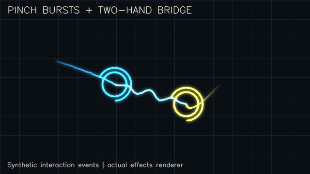

# Gesture Controls Lab — Neon FX

Trained MediaPipe gesture categories plus independent calibrated pinch controls.
Version 0.2.0 adds pinch-triggered bursts, coloured fingertip trails, orbiting
rings and a light bridge when two tracked hands are actively pinching.



## Run

Use standard CPython 3.12 in an isolated virtual environment:

```bash
python3.12 -m venv .venv
.venv/bin/python -m pip install --only-binary=:all: -r requirements.txt
.venv/bin/python -m unittest discover -s tests -v
.venv/bin/python app.py model
.venv/bin/python app.py check
.venv/bin/python app.py camera
```

The verified maintainer-Mac runtime is MediaPipe 1.0.0, OpenCV contrib 4.13.0,
and NumPy 2.3.5. Keep exactly one OpenCV provider installed.

O samples naturally separated thumb/index fingers for two seconds; P samples a
natural pinch for two seconds. Use one complete hand during calibration. Reopen
fingers before using the controls. Calibration is session-only.

1 selects pinch counting, 2 drawing and 3 an in-app slider. E switches neon effects
on/off. R resets the session, C clears strokes, Q/Esc exits. There is no system
mouse/keyboard control, video recording or camera upload by application code.

The effects respond to accepted interaction events, not every repeated video
frame. Effects are bounded and cleared on resets, stale input and calibration.
The two-hand bridge is a visual decoration, not contact or depth measurement.

## Limits

The seven trained categories, landmark model, association logic, pinch thresholds
and temporal decision rules are unchanged by FX. Version 0.2.0 adds no new gesture
recognition accuracy claim. Tracking can fail on occlusion, small hands, crossings
or slow observations. Native startup and physical camera access are verified
separately from real-world gesture accuracy.

Application source: MIT. Preserve THIRD_PARTY.md, including MediaPipe/model notices.
See docs/FX_VALIDATION.md for the release validation boundary.
